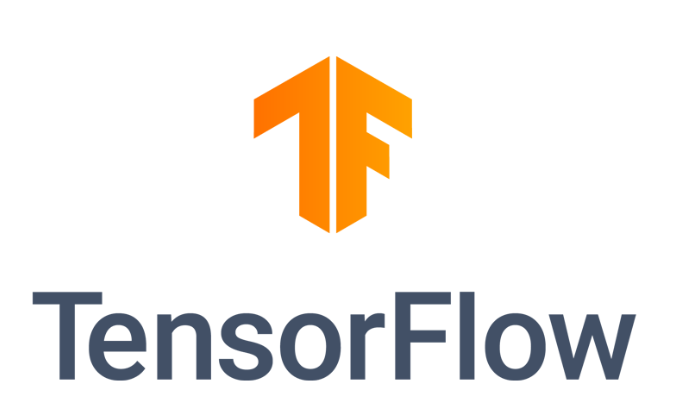

# TensorFlow 1.x & 2.0
KFU course for Master

 

## Syllabus
1. Introduction (*Lesson1*)
### TensorFlow 1.x module
2. TensorFlow Basics (*Lesson1, Appendix_Lesson1-2*)
3. TensorFlow program for Euclid distance calculation (*Lesson2*)
4. Control Dependencies (*Lesson2, Appendix_Lesson1-2, Appendix_Lesson2*)
5. Debug in TensorFlow 1.x (*Lesson2*)
6. Data Input Pipeline: TensorFlow Queue (*Lesson3*)
7. Data Input Pipeline:TensorFlow Queue: multithreading (*Lesson4*)
8. Data Input Pipeline: tf.data API and Performance (*Lesson5*)
9. Image Classification: TF Queue and tf.data (*Lesson6*)
10. High Level API: Keras & Estimator (*Lesson7*)
11. TensorFlow 1.x: Tricks, Pitfalls and Workarounds (*Lesson8, Appendix_Lesson8*)
### TensorFlow 2.0 module
12. TensorFlow 2.0 Introduction: Comparison with TensorFlow 1.x, AutoGraph, 
Build Model, Custom Layers/Model/Loss/Accuracy/Callbacks, tf.GradientTape (*Lesson9*)
13. Image Classification: Custom model, custom accuracy (*Lesson10, Lesson11*)
14. Logging and Visualization: TensorBoard, TensorBoard.dev, MLflow and Tensorspacejs (*Lesson12*)
